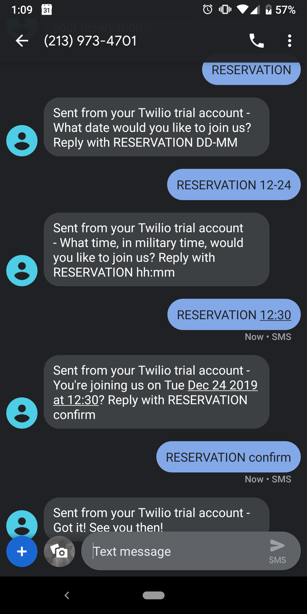
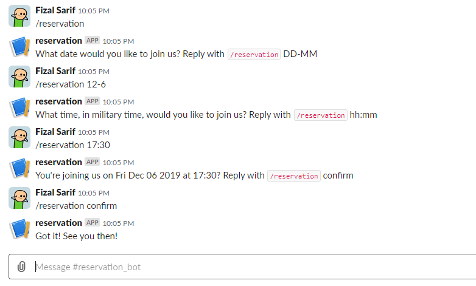

# Reservation Bot


## Introduction

Simple node project with travis-ci handling builds and deployed on heroku.
Check the `.travis.yml` file for the proper keys for deploying. You would have to generate your own token for heroku if you use this as a template.

[Click here to look at the finished Travis Job](https://travis-ci.org/fizal619/inclusion-t1-cap-week1-project)

## Travis YML used:

```yml
language: node_js
node_js:
- node
deploy:
  provider: heroku
  api_key:
    secure: your_own_key
```

## Screenshots




## How to Run

For the client
- `cd client`
- `npm i`
- `npm run start`

More on [CreateReactApp](https://github.com/facebook/create-react-app#quick-overview).

For the server
- `npm i`
- `npm run start-dev`

Testing
- server: `npm run test`
- client: `cd client && npm run test`

## Required Environment Variables

- `DATABASE_URL` a postgresql database url. Tables will be made on server start.